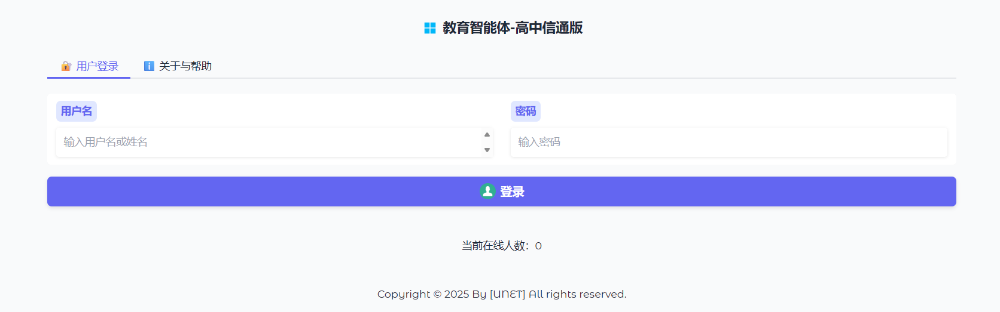
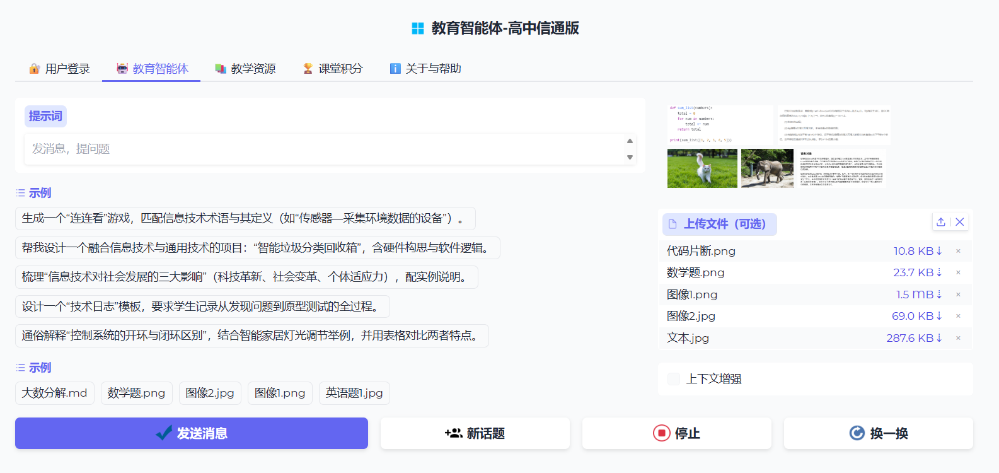

# 教育智能体-高中信通版 (SmartKB) 使用指南

## 系统概述

教育智能体-高中信通版（SmartKB）是一款面向高中信息技术与通用技术课程的AI智能问答与教学管理平台。系统结合本地用户管理、文件检索、任务管理、教学资源管理以及云端/本地AI能力，提供教师、学生与管理员不同角色的运行环境。

## 核心功能

### 1. 用户管理与权限控制

- 支持管理员、教师、学生三类角色。
- 管理员可注册新用户、删除用户、批量导入/删除用户、重置密码。
- 普通用户可修改自身信息、修改密码。
- 登录支持用户名或姓名双重输入。
- 密码采用 bcrypt 安全加密存储。
- 默认管理员账号：root / root。

### 2. AI 对话服务

- 支持多种对话模式：
  - 云端智能体版：调用 DashScope 兼容模式接口，使用 Qwen 系列模型进行智能对话。
  - 本地知识库版：通过本地检索增强生成（RAG）处理资料查询和离线知识检索。
  - 本地智能体版：使用智能体工作流处理复杂任务与多步骤推理。
- 支持文本对话、图像理解和文档理解。
- 可对文件内容自动生成摘要，增强对话上下文。

### 3. 文件与资源管理

- 支持上传文档与图片文件，自动识别文件类型。
- 文档格式支持：TXT、MD、PDF、DOC、DOCX、XLS、XLSX、PPT、PPTX、CSV、JSON、HTML 等。
- 图像格式支持：JPG、JPEG、PNG、GIF、BMP、TIFF、WEBP。
- 管理员与教师拥有教学资源页面，可上传和管理 HTML 资源。
- 系统提供文件浏览器和 HTML 资源预览功能。

### 4. 任务管理与课堂积分

- 管理员和教师可创建教学任务。
- 系统支持任务激活、任务提交、任务汇总。
- 管理员可查看所有教师和学生的活动任务。
- 管理员与教师可访问课堂积分页面，查看积分统计与任务完成情况。

### 5. 对话历史与数据保存

- 用户对话历史按用户目录自动保存。
- 系统支持按用户和日期分类存储历史记录。
- 所有访问行为会写入日志文件，便于分析和审计。

## 快速开始

1. 将工作目录切换到项目根目录：
   cd /d d:\AgentSmartKB
2. 安装依赖：
   pip install -r requirements.txt
3. 启动应用：
   python AgentSmartKBXS.py
4. 默认管理员登录：
   - 用户名：root
   - 密码：root

## 登录与使用说明

- 登录时可输入用户名或姓名。
- 若姓名重复，将提示改为使用用户名登录。
- 登录成功后，将进入主界面并显示当前在线人数。
- 管理员与教师可访问“教学资源”和“课堂积分”标签页。

## 用户管理说明

- 管理员可通过用户管理面板：
  - 注册新用户
  - 修改用户信息
  - 修改用户密码
  - 删除用户
  - 批量导入用户
  - 批量删除用户
- 普通用户只能修改自己的个人信息和密码。

## 数据存储说明

- 用户账户数据存储在根目录下的 users.db。
- 对话历史存储在各用户目录下的 ChatHistory 子目录中。
- 管理员统一任务信息存储在 root/ChatHistory/tasks/all_active_tasks.json。
- HTML 资源和教学内容存储在 root/html 及各用户目录下的对应文件夹。

## 注意事项

- 如果想使用云端 DashScope 服务，请配置 .env 中的 API Key。
- 文件上传大小限制：文档最大 10MB，图像最大 5MB。
- 本地模式和云端模式可以根据网络、隐私和资源选择使用。

## 常见问题

### Q: 忘记密码怎么办？

A: 请使用管理员账号登录后，进入用户管理面板重置用户密码。

### Q: 登录失败提示“姓名重复”？

A: 说明系统中有多个用户同名，请改用用户名登录。

### Q: 为什么看不到“教学资源”页？

A: 只有管理员和教师角色可以查看教学资源和课堂积分页。

## 技术支持

如需功能定制或遇到问题，请联系系统维护人员或技术支持团队。

---

SmartKB - 让 AI 赋能教育，让学习更智能。
